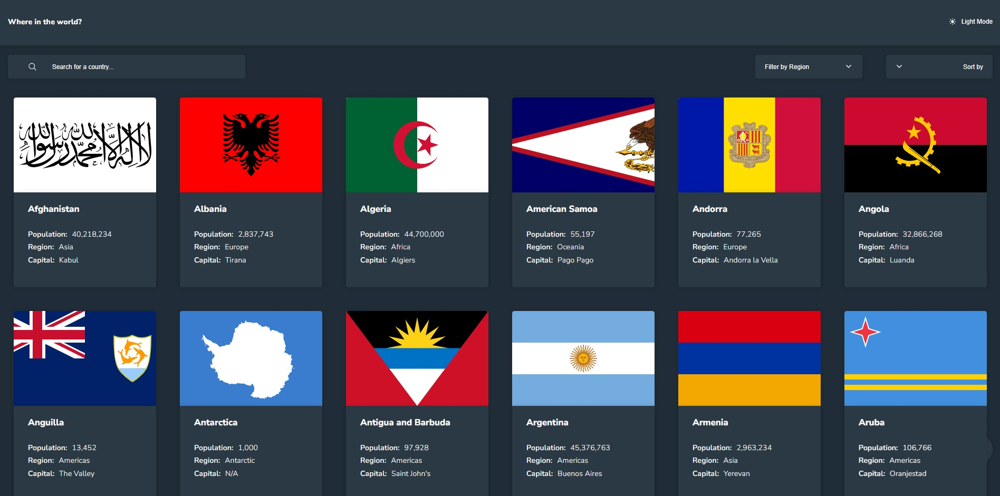

# Frontend Mentor - REST Countries API with color theme switcher solution

This is a solution to the [REST Countries API with color theme switcher challenge on Frontend Mentor](https://www.frontendmentor.io/challenges/rest-countries-api-with-color-theme-switcher-5cacc469fec04111f7b848ca). Frontend Mentor challenges help you improve your coding skills by building realistic projects. 

## Table of contents

- [Overview](#overview)
  - [The challenge](#the-challenge)
  - [Screenshot](#screenshot)
  - [Links](#links)
- [My process](#my-process)
  - [Built with](#built-with)
  - [What I learned](#what-i-learned)
  - [Continued development](#continued-development)
- [Author](#author)
- [Acknowledgments](#acknowledgments)

**Note: Delete this note and update the table of contents based on what sections you keep.**

## Overview
solution to the Rest Countries API Challenge, using primarily JQuery, XMLHttpRequest for API connection and CSS variables for theme switcher

### The challenge

Users should be able to:

- See all countries from the API on the homepage
- Search for a country using an `input` field
- Filter countries by region
- Sort countries by Alphabetical order and population
- Click on a country to see more detailed information on a separate page
- Click through to the border countries on the detail page
- Toggle the color scheme between light and dark mode 

### Screenshot



### Links

- Solution URL: [Add solution URL here](https://github.com/ovie009/rest-countries-api-with-color-theme-switcher-master)
- Live Site URL: [Add live site URL here](https://ovie009.github.io/rest-countries-api-with-color-theme-switcher-master/)

## My process
-HTMl firts
-Mobile first CSS
-with use of display flex and max-width css properties, no media query was needed

### Built with

- Semantic HTML5 markup
- CSS custom properties
- Flexbox
- Mobile-first workflow
- [JQuery](jquery-3.6.0.min.js) - as javascript library

### What I learned

- How to pull data from API
- Handling API data
- Dynamically appending HTML Elements with javascript
- Using Cookies to store chosen themes
- Interesting facts about countries

```css
.card{
  max-width: 300px;
  width: 75%;
  border-radius: 5px;
  border: none;
  box-shadow: var(--boxShadow);
}
```
```js
// function to append country details if country is selected
function appendCountry(country) {
  console.log("🚀 ~ file: main.js ~ line 282 ~ appendCountry ~ country", country)
  
  let countryFlag = country[0].flags.svg; // country flag
  let countryName = country[0].name.common; // country name
  let countryPopulation = country[0].population; // country population
  // convert population to string and insert commas after every 3 digits from behind
  countryPopulation = stringifyPopulation(countryPopulation); 
  let countryRegion = country[0].region; // couintry region
  let countrySubregion = country[0].subregion; // couintry subregion
  let countryCapital; // country capital
  let countryTld = country[0].tld[0]; // couintry top level domain

  let countryNativeName; // country native name

  // block of code to select county native name, because some countries have multiple native names
  let nativeNameLanguage = Object.keys(country[0].name.nativeName);
  for (let index = 0; index < nativeNameLanguage.length; index++) {
    if (index === 0) {
      countryNativeName = ''+country[0].name.nativeName[nativeNameLanguage[index]].common;
    } else {
      countryNativeName += ', '+country[0].name.nativeName[nativeNameLanguage[index]].common;
    }
  }

  let countryCurrency; // currency currency

  // block of code to select county currency, because some countries have multiple currencies
  let currienciesList = Object.keys(country[0].currencies);
  for (let index = 0; index < currienciesList.length; index++) {
    if (index === 0) {
      countryCurrency = ''+country[0].currencies[currienciesList[index]].name;
    } else {
      countryCurrency += ', '+country[0].currencies[currienciesList[index]].name;
    }
  }

  let countryLanguages; // currency currency

  // block of code to select county language, because some countries have multiple languages
  let languageList = Object.keys(country[0].languages);
  for (let index = 0; index < languageList.length; index++) {
    if (index === 0) {
      countryLanguages = ''+country[0].languages[languageList[index]];
    } else {
      countryLanguages += ', '+country[0].languages[languageList[index]];
    }
  }
  // console.log("🚀 ~ file: main.js ~ line 216 ~ appendCountry ~ countryLanguages", countryLanguages)

  // checking if country has a capital
  if (country[0].capital) { // if country has capital
    countryCapital = country[0].capital; // equate countryCapital variable top the capital in the JSON array    
  } else {
    countryCapital = 'N/A'; // if capital is unavaliable, equate to N/A
  }

  let countryBorders = ''; // border countries
  // checking if country has a boarder country
  if (country[0].borders) { // if country has border COUNTRIES
    let borderList = country[0].borders;
    let borderCountryName;
    countries = fullCountryData;
    for (let index = 0; index < borderList.length; index++) {
      borderCountryName = selectCountryNameFromCode(borderList[index], countries);
      countryBorders += `<button class="border-buttons" type="button" onclick="clickCard('${borderList[index]}')">${borderCountryName}</button>`;
    }
  } else { // if copuntry has no border
    countryBorders = '<span>N/A</span>'; // if capital is unavaliable, equate to N/A
  }

  // country details element
  let countryDetails = $('.country-details-wrapper');
  // country element
  let countryElement = `<div class="country-flag-wrapper">
    
  </div>
  <div class="country-info-wrapper">
    <h3>${countryName}</h3>
    <div class="details-wrapper">
      <section>
        <div><h4>Native Name:</h4><span>
          ${countryNativeName}
        </span> </div>
        <div><h4>Population:</h4><span>${countryPopulation}</span> </div>
        <div><h4>Region:</h4><span>${countryRegion}</span> </div>
        <div><h4>Sub Region:</h4><span>${countrySubregion}</span> </div>
        <div><h4>Capital:</h4><span>${countryCapital}</span> </div>
      </section>
      <section>
        <div><h4>Top Level Domain:</h4><span>${countryTld}</span> </div>
        <div><h4>Curriencies:</h4><span>${countryCurrency}</span> </div>
        <div><h4>Language:</h4><span>${countryLanguages}</span> </div>
      </section>
    </div>
    <section class="border-section">
      <h4 class="border-heading">Border Countires</h4>
      <div class="border-countries-wrapper">
        ${countryBorders}
      </div>
    </section>
  </div>`;
  // remove any present country details
  $('.country-flag-wrapper').remove();
  $('.country-info-wrapper').remove();
  // add new country details
  countryDetails.append(countryElement);
}

```

### Continued development

- Add more information to Country Details

## Author

- Website - [Iffie Ovie](https://ovie009.github.io/portfolio/)
- Frontend Mentor - [@ovie009](https://www.frontendmentor.io/profile/yourusername)
- Twitter - [@iffieovie](https://www.twitter.com/yourusername)

## Acknowledgments

- Design suggestions by - [Ejovwoke](https://ejovwoke.netlify.app/)
- Design Suggestions by Ikedinobi